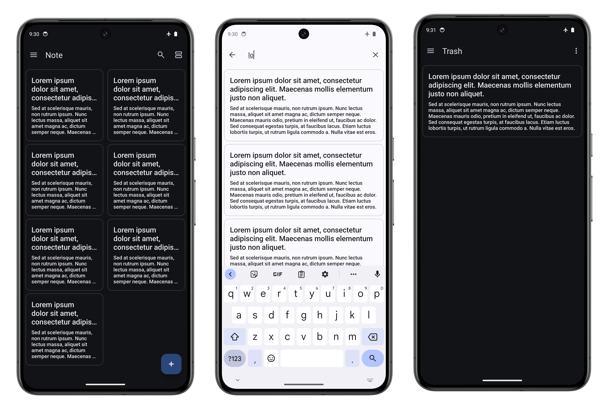

## Diary - Simple Note-taking Android App

### The goal of creating this project is to stay up to date with modern android development.

This App will build on

Android `Views` (XML).

`Room` database for local db.

`Preference Datastore` for storing user preference.

`Dagger Hilt` for Dependency Injection.

`Navigation Component` to navigate between fragments.

Reactive Ui using Kotlin Flows and Coroutines.

Implemented Settings using the `PreferenceSettingCompat` library.

### Note 👀

_About this Project_

This project aims to showcase the modern android architecture to build clean, maintainable and scalable android app

1. Layered Architecture

2. Structuring Package's for Clean Architecture

3. Per Screen ViewModel for Ui related logic

Kotlin Coroutines & Flows for Reactive UI, and Asynchronous Programming.

### This Project also include unit testing, to ensure our code works properly as intended.

**Differences**

In this project you will find two more branches named `Improvement`, and a `features`
features branch is used to add new features to this project. The improvement branch is used to improve the existing features.

### Features ✅

The main features of this app

- [x] CRUD for notes.

- [x] Archive and Delete notes.

- [x] Search note through Room FTS.

- [x] Dynamic theme Android 12+.

- [x] The dark theme and light theme control through settings.

- [x] Edge to Edge.

_And other Miscellaneous features..._

### Improvements 🚀

This app is currently in development. New features and improvements might be added. Some important features you can expect include 🚧

- [ ] Reminder's with Notification.

- [ ] Sorting and filtering the notes and some others.

- [ ] Probably i can switch views to compose.

### Contribution 🤝

If you would like to contribute to this project, you can do it. As I already mentioned, 
this project primarily focuses on architecture use Layered Architecture and SOLID principles. 
All features and improvements should be committed to respective branches, not directly to the main.
